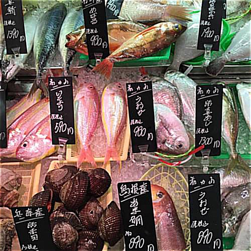
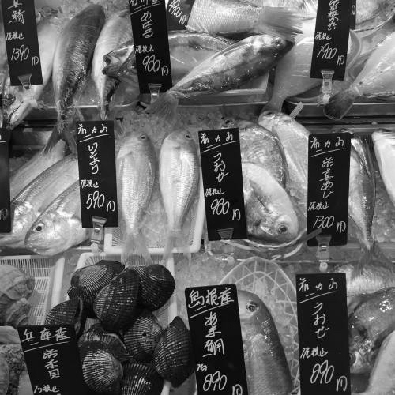
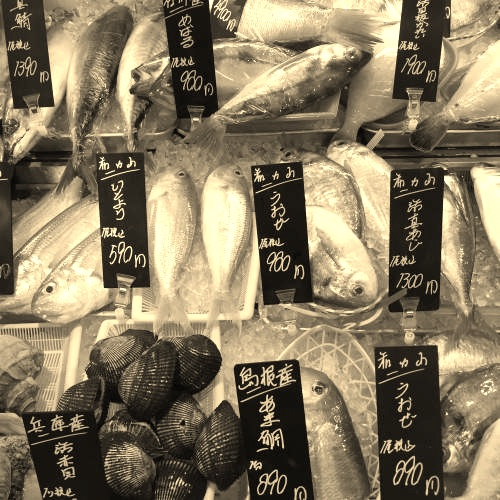

# ImageProcessing
OOD Image Processing Instagram Model

## The model interface
Our model, of the interface `InstagramModel`, includes features to import images of `InstaImage` types, as well as PPM file names. Once an image has been imported
into the model, the client can choose to filter the image with the options of `blur` and `sharpen`. On top of this, they can also choose to color transform the
image into `greyscale` or `sepia`. Any time during this, if the model is holding an image, it can be exported in PPM file format, as well as `InstaImage` format. 
If the client attempts to execute any exports or image processing commands while the model holds no image, an error will be thrown.

### InstagramModelImpl
`InstagramModelImpl` is a sub class of `InstagramModel` that uses the `ImageImpl` representation of images. More information of `ImageImpl` and its interface can be seen below. 
#### Image Processing Functionality
As per the interface, `InstagramModelImpl` has `filter(...)`, which will adjust the visual quality of the image such as blurring, and `transform(...)`, which will change the color make-up of the image, functionality. Specifically, `InstagramModelImpl` is able to do the following operations:
1.Filter
  * Blur
  * Sharpen
2.Transform
  * Greyscale
  * Sepia\
`filter(String operation)` takes in the string (not case sensitive) to represent the particular filter to be applied.
`transform(String operation)` takes in the string (not case sensitive) to represent the particular color transofmration to be applied.
Note that these image processes will mutate the image, and you can not return to the past images unless you `save` the version you would like to return to. More information can be seen under 'Saving and Retrieving Images'.

Examples of each operation can be seen below using the following image as an original:\
\
Filter - Blur:\
\
Filter - Sharpen:\
\
Transform - Greyscale:\
\
Transfrom - Sepia:\

 
 #### Saving and Retrieving Images
 With the methods `save()` and `retrieve()`, the client is also able to save their images to a log in the model. Once images are saved to the log, they can be retrieved. Retrieving an image means to return to the last saved image in a log. Once the client has returned to a past image, they can not go back. Note that unless the client explicitly calls the `save()` method, the image will not be saved to the log and can not be retrieved. If there is currently no image to retrieved or no image to be saved, these methods will throw `IllegalStateException`s.
 
 #### Importing and Exporting From `InstagramModelImpl`
 Currently, `InstagramModelImpl` supports two types of image representations: `InstaImage` and PPM images. In order to import a PPM image, the client can pass to the `readPPM(String filename)` the filename / path of their image, relative to the position of the model in the file system. Similarly, `exportAsPPM(String title)` allows the client to export the current image in the model to a PPM file, and provides the client to choose the title of the file as well. If the file name already exists, a (n) number will be attached to the end of the file name to indicate that it is the nth file to be named that title in the directory. Images can also be imported as `InstaImage` through `readInstaImage(InstaImage image)` where the client can directly pass the model an `InstaImage`, as well as export the current model image with `exportAsInstaImage()`.

## InstaImage
InstaImage is an object type that holds the important information of an image. It holds the grid of `Pixel`s to represent the image, as well as a height and width
in pixels. InstaImage can also produce and return algorithmic images such as a rainbow flag, and a black and white checkerboard. 

#### Creating Programmatic Images
`InstaImage` also provides clients with the ability to set their `InstaImage` to a programmatically created image using methods attached to `InstaImage` objects. Mainly clients can create checkerboards and rainbows.
To create a checkerboard, clients can call `makeCheckerboard(int size)`, pass the desired pixel size of their checkerboard, and the `InstaImage` will be set to a checkerboard of pixel size X size. 
To create a rainbow, clients can call `makeRainbow(int width, int colorHeight)` where the width is the pixel width of the resulting image, and the colorHeight is the vertical height in pixels of each color in the resulting rainbow image. 

## Pixel
A `Pixel` holds 3 channels R, G, and B which represent the red, green, and blue components of the resulting color the pixel holds. These channels are represented with `Channel` objects. 
`Pixel`s can be checked for equality based on the values of their corresponding R, G, and B channels. 
Furthermore, in order to set `Pixel`s to new values, clients can use `setR(double n)`, `setG(double n)`, and `setB(double n)`. These methods will accept a double value, round it to the nearest integer, and set it to the corresponding channel value. If the given value is not within 0-255, it will be capped off at 0 if too small, and 255 if too big. `Pixel` has also overridden the `toString()` method, and a pixel is represented as a string with it's RGB values. For example, a completely red pixel would be represented as below:\
`R: 255 G: 0 B: 0`

## Channel
A `Channel` holds an integer value from `0-255` which represents the amount of its particular color in a pixel. 
There are three types of channels currently, `ChannelR`, `ChannelG`, and `ChannelB`. In the case where a client attempts to set the value of a channel to any amount less than 0, it will be defaulted to 0, and if a client attempts to set the value of a channel to any amount more than 255, it will be defaulted to 255. 
The `setValue(double n)` for `Channel`s take in double values, but they will round those values on a .5 basis to the nearest integer. 
`Channel`s are checked for equality based on whether they are the same channel type (R, G, or B), and their values. 
`Channel` has overriden the `toString()` method, and will be represented with their corresponding channel type, as well as the value. For example, a 125 value holding Blue channel would be represented as below:\
`B: 125`
