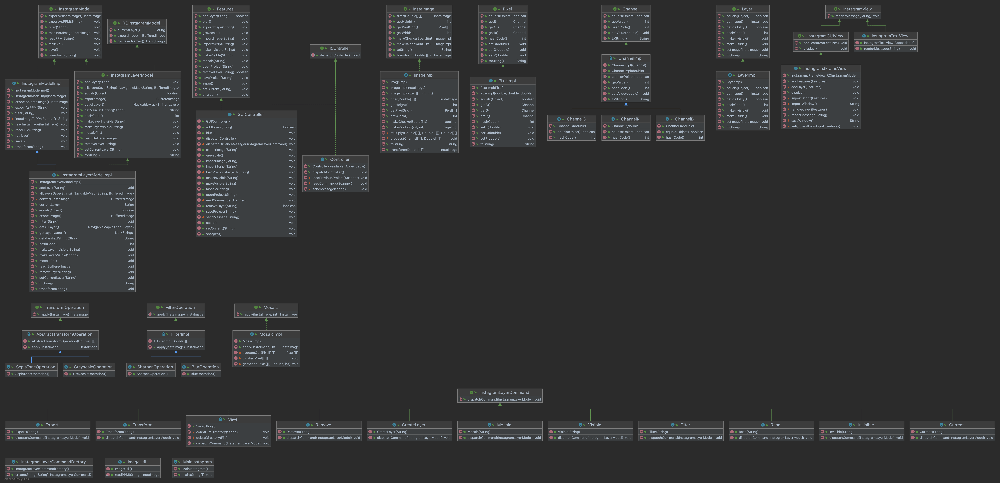

# ImageProcessing

OOD Image Processing Instagram Model

## The Model Diagram

Our total model looks like this in a diagram. (Built using IntelliJ)\

## The model interface

Our model, of the interface `InstagramModel`, includes features to import images of `InstaImage`
types, as well as PPM file names. Once an image has been imported into the model, the client can
choose to filter the image with the options of `blur` and `sharpen`. On top of this, they can also
choose to color transform the image into `greyscale` or `sepia`. Any time during this, if the model
is holding an image, it can be exported in PPM file format, as well as `InstaImage` format. If the
client attempts to execute any exports or image processing commands while the model holds no image,
an error will be thrown.

### InstagramModelImpl

`InstagramModelImpl` is a sub class of `InstagramModel` that uses the `ImageImpl` representation of
images. More information of `ImageImpl` and its interface can be seen below.

#### Image Processing Functionality

As per the interface, `InstagramModelImpl` has `filter(...)`, which will adjust the visual quality
of the image such as blurring, and `transform(...)`, which will change the color make-up of the
image, functionality. Specifically, `InstagramModelImpl` is able to do the following operations:
1.Filter

* Blur
* Sharpen 2.Transform
* Greyscale
* Sepia\
  `filter(String operation)` takes in the string (not case-sensitive) to represent the particular
  filter to be applied.
  `transform(String operation)` takes in the string (not case-sensitive) to represent the particular
  color transofmration to be applied. Note that these image processes will mutate the image, and you
  can not return to the past images unless you `save` the version you would like to return to. More
  information can be seen under 'Saving and Retrieving Images'.

##### Example Images

(example images have been converted to jpeg files for .md file processing) \
Source: Katsuhiko Nakanishi (Contributor to the project)\
Examples of each operation can be seen below using the following image as an original:\
\
Filter - Blur:\
\
Filter - Sharpen:\
\
Transform - Greyscale:\
\
Transfrom - Sepia:\

#### Saving and Retrieving Images

With the methods `save()` and `retrieve()`, the client is also able to save their images to a log in
the model. Once images are saved to the log, they can be retrieved. Retrieving an image means to
return to the last saved image in a log. Once the client has returned to a past image, they can not
go back. Note that unless the client explicitly calls the `save()` method, the image will not be
saved to the log and can not be retrieved. If there is currently no image to retrieved or no image
to be saved, these methods will throw `IllegalStateException`s.

#### Importing and Exporting From `InstagramModelImpl`

Currently, `InstagramModelImpl` supports two types of image representations: `InstaImage` and PPM
images. In order to import a PPM image, the client can pass to the `readPPM(String filename)` the
filename / path of their image, relative to the position of the model in the file system.
Similarly, `exportAsPPM(String title)` allows the client to export the current image in the model to
a PPM file, and provides the client to choose the title of the file as well. If the file name
already exists, a (n) number will be attached to the end of the file name to indicate that it is the
nth file to be named that title in the directory. Images can also be imported as `InstaImage`
through `readInstaImage(InstaImage image)` where the client can directly pass the model
an `InstaImage`, as well as export the current model image with `exportAsInstaImage()`.

### InstagramLayerModel & InstagramLayerModelImpl

`InstagramLayerModel` adds layering functionality to the model above. It allows clients to add
multiple layers to a project, export/import to them separately, work on them separately, as well as
save a project as a multi-layered image.\

#### A multi-layered image

A multi-layered image is essentially a folder containing `.png` files of all layers in the project,
as well as a main.txt text file that has the ability to rebuild the project of layers with the given
names from the images in the project file.\

#### Working on layers

Each layer can be worked on as per specified above in the `InstagramModelImpl` behavior.\

#### Exporting layers

Layers can be exported separately by specifying which current layer you are working on, and then
providing a name of the image to be exported. The name of the image must include a '.---' extension
to specify the type of image to be exported. The image may be exported as 'jpeg' or 'png' files, not
just restricted to PPM files as `InstagramModelImpl` is.

#### Importing images

Images of all types can be imported to `InstagramLayerModel` objects. The filepath must be specified
and the image will be converted to a `InstaImage` within `InstagramLayerModelImpl` so it can be
processed as per the `InstagramModel` interface.

#### Saving your project

Not only can image files of various types be exported from each layer of
an `InstagramLayerModelImpl`, but you can also save an entire project, that may be reopened later
on. Saving of a project saves this model as a 'multi-layered image'. Essentially, the model will
create a new directory with the given name, and save each layer of the model in there (if it has an
image) as a png image file. It will also build a main.txt text file that can be used to re-open the
Instagram project.

### ROInstagramModel

This interface includes the ability to get the string name of the current layer, the list of all the
layers in the model, and a `BufferedImage` object that represents the top most visible layer of the
model. In our implementation, since this `ROInstagramModel` includes observer methods for
Multi-layer implementations of the InstagramModel, only the `InstagramLayerModel` interface extends
this interface.

## InstaImage

InstaImage is an object type that holds the important information of an image. It holds the grid
of `Pixel`s to represent the image, as well as a height and width in pixels. InstaImage can also
produce and return algorithmic images such as a rainbow flag, and a black and white checkerboard.

#### Creating Programmatic Images

`InstaImage` also provides clients with the ability to set their `InstaImage` to a programmatically
created image using methods attached to `InstaImage` objects. Mainly clients can create
checkerboards and rainbows. To create a checkerboard, clients can call `makeCheckerboard(int size)`,
pass the desired pixel size of their checkerboard, and the `InstaImage` will be set to a
checkerboard of pixel size X size. \
For example, `new ImageImpl().makeCheckerBoard(20)` produces the following image:\
\
To create a rainbow, clients can call `makeRainbow(int width, int colorHeight)` where the width is
the pixel width of the resulting image, and the colorHeight is the vertical height in pixels of each
color in the resulting rainbow image.\
For example, `new ImageImpl().makeRainbow(30, 70)` produces the following image:\

## Pixel

A `Pixel` holds 3 channels R, G, and B which represent the red, green, and blue components of the
resulting color the pixel holds. These channels are represented with `Channel` objects.
`Pixel`s can be checked for equality based on the values of their corresponding R, G, and B
channels. Furthermore, in order to set `Pixel`s to new values, clients can use `setR(double n)`
, `setG(double n)`, and `setB(double n)`. These methods will accept a double value, round it to the
nearest integer, and set it to the corresponding channel value. If the given value is not within
0-255, it will be capped off at 0 if too small, and 255 if too big. `Pixel` has also overridden
the `toString()` method, and a pixel is represented as a string with it's RGB values. For example, a
completely red pixel would be represented as below:\
`R: 255 G: 0 B: 0`

## Channel

A `Channel` holds an integer value from `0-255` which represents the amount of its particular color
in a pixel. There are three types of channels currently, `ChannelR`, `ChannelG`, and `ChannelB`. In
the case where a client attempts to set the value of a channel to any amount less than 0, it will be
defaulted to 0, and if a client attempts to set the value of a channel to any amount more than 255,
it will be defaulted to 255. The `setValue(double n)` for `Channel`s take in double values, but they
will round those values on a .5 basis to the nearest integer.
`Channel`s are checked for equality based on whether they are the same channel type (R, G, or B),
and their values.
`Channel` has overriden the `toString()` method, and will be represented with their corresponding
channel type, as well as the value. For example, a 125 value holding Blue channel would be
represented as below:\
`B: 125`

## Additional Examples

Again, all images shown in this README.md are jpeg images so that they show up, however the ppm
images used with the `InstagramModel` application can be found in the `images/ppm` folder. Using the
following image as an original, here are the results of applying certain filters and
transformations, some in combination.\
Source: Katsuhiko Nakanishi (Contributor to the project)\
\
Filter - Blur:\
\
Transform - Sharpen:\
\
Transfrom - Greyscale:\
\
Transfrom - Sepia:\

## How to run the program

Instructions on how to run our program through the view and controller is listed and explained in
the USEME.md. Please refer to that file.

## Design / Model Changes

###### From assignment 5 to 6:

We moved exporting and reading external images and files from the model to the controller. We
figured this was necessary to keep all I/O operations completely separate from the model.

###### From assignment 6 to 7 (Including Extra Credit):

We added an additional interface layer called `ROInstagramModel` which has within it public observer
methods that may be necessary for a view class to accurately represent the model. We pass the
an `ROInstagramModel` object to the view in its constructor, which allows it to show the current
state of the model as an ImageIcon as well as accurately represent what layers are in the model
through a ComboBox.   
We added `Mosaic` functionality to InstagramLayerModel. This meant adding a
new `mosaic(InstaImage image, int seed)` function to our InstagramLayerModel interface, and also
a `Command` object that allows this functionality to be intergrated appropriately in the controller.
We added a `Mosaic` interface to our model package, whose objects do all the calculations for the
random seed mosaic-ing of the given image.  
Mosaic original: 
  
Mosaic by seed of 10: 
 
Mosaic by seed of 100: 
 
Mosaic by seed of 1000: 
 

## Assumptions

### Assignment 6 - the Textual View / Controller

We assume that people will initially interact with the model before sending in a script. Therefore,
even when sending in a script of commands, the user must tell the controller that it will be doing
that. We also assume that the user understands that the file paths sent to the controller must be
sent with the understanding that the paths originate from where this application is held. For
example, if a photo is in the same directory as this program, it would just need the file name, not
any directory paths.

When old projects are to be reopened:

* They can not be moved from their position in directories since they were saved.
* The location of the application/jar can not be moved since last used. If the above is not
  followed:
* The application will be unable to open the contents of the project, even if it can successfully
  find the project directory, since the main.txt that will do the reopening of the project is built
  based on the old directory path.

### Assignment 7 - the GUI View / Controller

Assuming that they also saved the project through the GUI version of this application, all sorts of
scripts can be imported and the scripts can be moved. However, the pictures that will be reloaded
into the application as a part of the project can not be moved between the last save and re-open.

## Limitations

Although not included in the requirements, it was hinted at in the beginning of the assignment. This
application currently does not handle semi-transparent images (where you would be able to see) the
layer below if the layer above's image had a hole in it. Also, we have not fully implemented
blending yet so that is also a slight limitation. (Again, not part of the requirements for this
assignment.)
